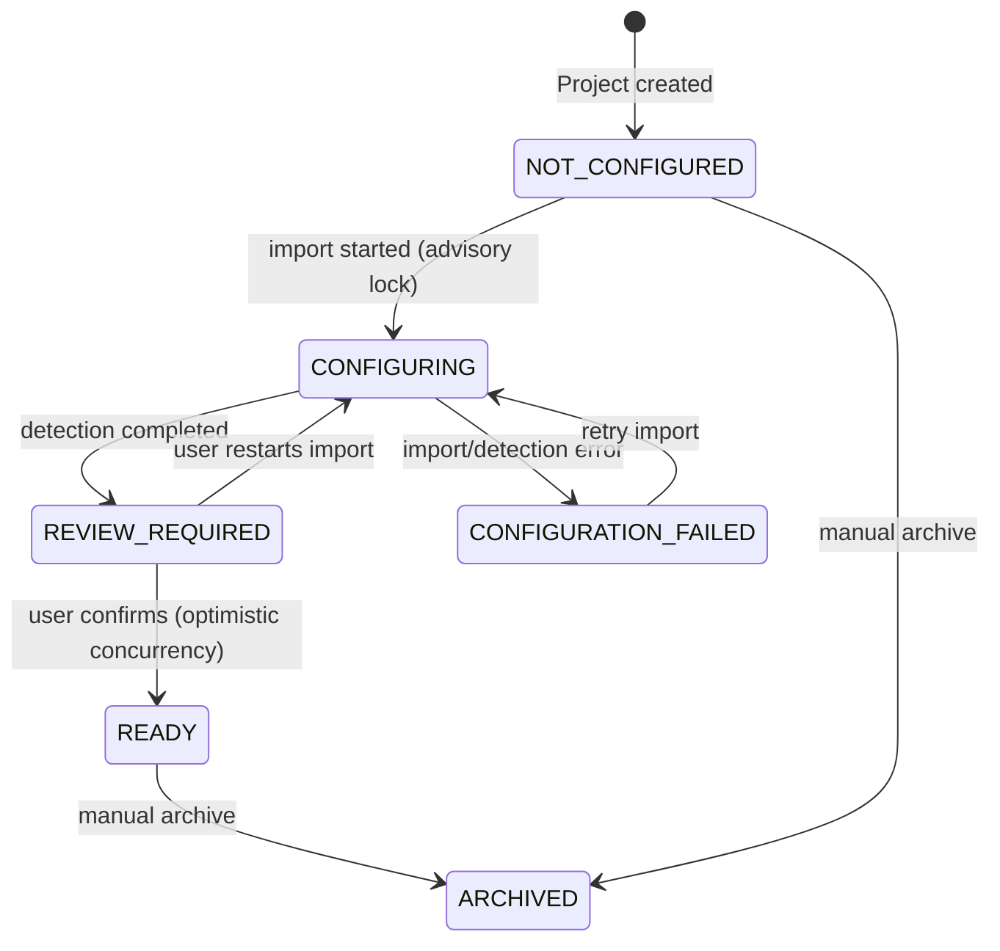
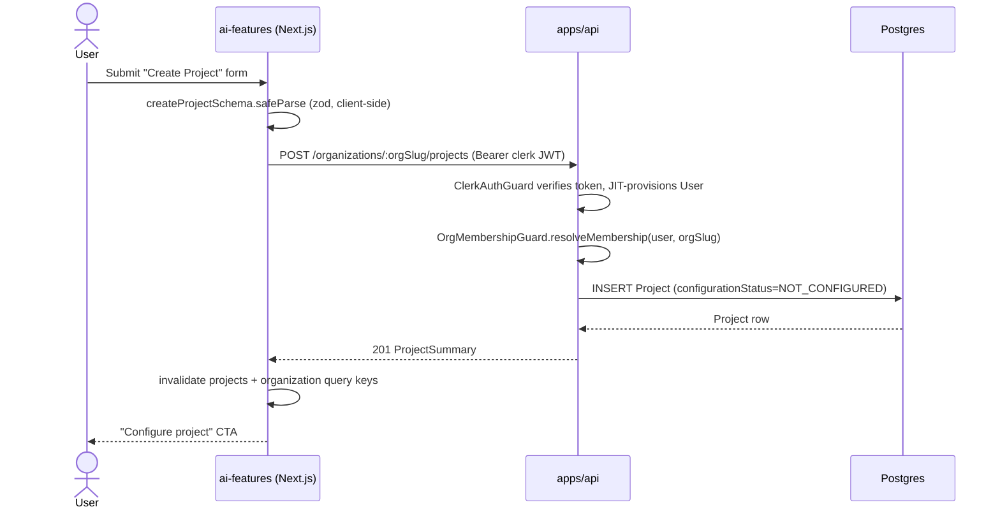
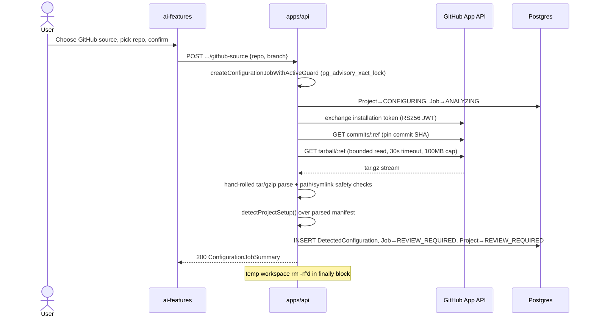
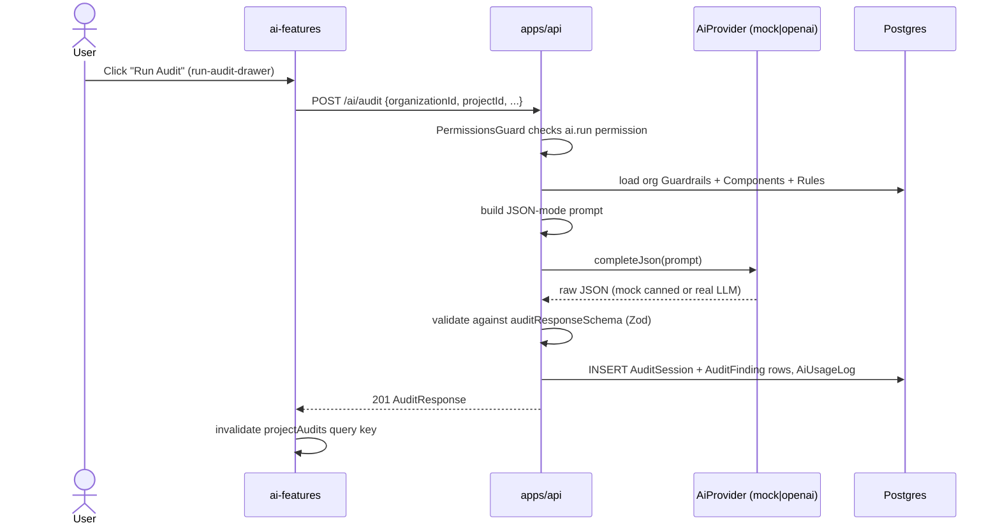
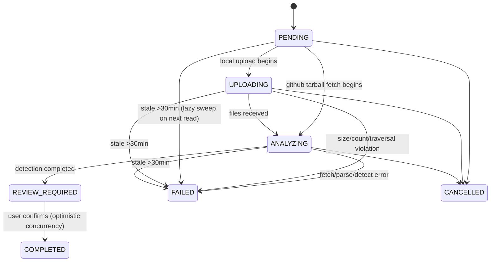
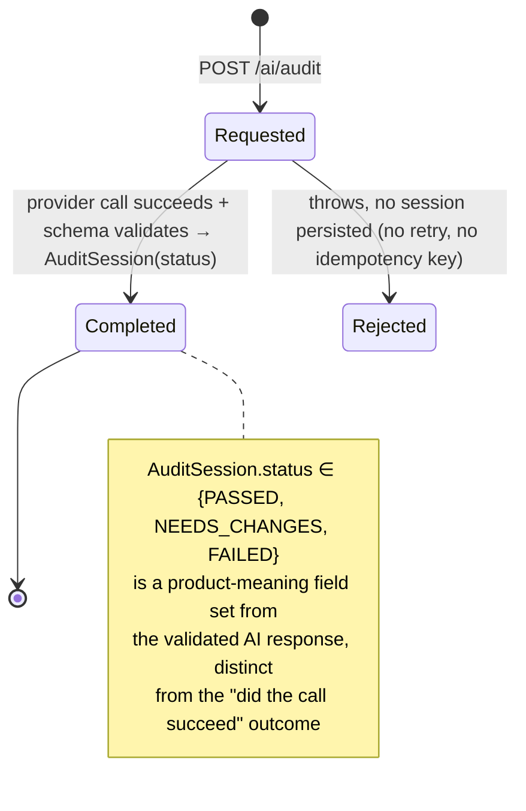
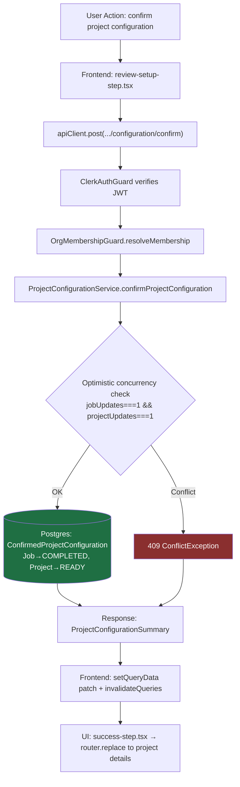

# ComponentIQ — Architecture Handoff (as-built, July 2026)

> Audience: Staff engineer continuing system design. This reflects the ACTUAL repository state, not intent. "Implemented" = wired end-to-end and exercised by tests or real code paths. "Partially implemented" = real code exists but with a known gap. "Planned" = referenced but not built. "Technical debt" = built, working, but structurally risky.

---

## 1. Executive Summary

**What exists today:** A two-service product — a NestJS API (`apps/api`) backed by Postgres/Prisma, and a Next.js App Router frontend (`apps/ai-features`) — that lets an organization (1) create a "Project," (2) import its source either by uploading local files or connecting a GitHub App installation, (3) run a fully deterministic (non-AI) static detector over that source to guess framework/language/package manager/styling system/component & token paths, (4) have a human review and confirm that detected configuration, and (5) optionally invoke a separate AI subsystem to run an "audit" or "recommend a component" against the org's own guardrails/component catalog. A design-system component library (`packages/design-system`, published to npm as `componentiq`) and its Storybook host (`apps/docs`) are a third, largely independent workstream.

**Who the user is:** An engineer or design-system maintainer inside an organization (multi-tenant B2B model — `Organization` is the tenant root, Clerk supplies identity). Roles: OWNER/ADMIN/MAINTAINER/ENGINEER/VIEWER.

**Problem it solves (as scoped today):** Reduce the manual work of figuring out "what is this codebase's design-system setup" (framework, tokens, component locations) and provide a place to store org-specific component/guardrail rules that a (currently mock-by-default) AI can reference when giving component recommendations or pre-PR audits.

**Current maturity:** Early-stage, single-tenant-tested, pre-production. **Only two things are actually decided and finished end-to-end: organization onboarding (create/join org, invites, membership) and project onboarding (create a project, import source, review/confirm detected configuration).** Everything else in the product — final AI architecture, the org dashboard, project settings, guardrails/components management, audit findings/overrides, deployment readiness — is **not a settled design**. Code exists in some of these areas (see §12 on AI), but it should be read as exploratory/prototype scaffolding, not an architecture to preserve or extend as-is. This distinction matters a lot for a system-design conversation: the AI section below, in particular, should be read as "two early explorations of the same unmade decision," not "legacy debt to reconcile." There is no background job system, no queue, and no webhook receiver anywhere in the codebase — every long-ish operation (file detection, tarball parsing, AI call) runs synchronously inside an HTTP request.

---

## 2. High-Level Architecture

**Frontend:** Next.js 15 App Router app (`apps/ai-features`), Clerk for auth, TanStack Query for all server state, a single small Zustand store for workspace/session UI state (not domain data), React Hook Form + Zod used inconsistently across forms, `componentiq` design-system package for all primitives.

**Backend:** NestJS (`apps/api`), Prisma ORM over Postgres, Clerk bearer-token verification, DTO (class-validator) + Zod hybrid validation, Swagger at `/api/docs`. Deployed as a **standalone Docker container** (its own Dockerfile, `apps/api/Dockerfile`, `CMD npx prisma migrate deploy && node dist/.../main.js`) — not on Vercel.

**Database:** Single Postgres instance, one schema, tenant isolation enforced entirely at the application/query layer (every table carries `organizationId`, every service filters on it manually — no Postgres RLS).

**Shared packages:**
- `packages/shared-types` (`@winniekagendo/componentiq-shared-types`) — the canonical cross-app contract: enums (roles, permissions, project/job status, severities, frameworks…) and Zod schemas, consumed by both apps.
- `packages/design-system` (npm-published as `componentiq`) — Radix + Tailwind component library, consumed by `apps/ai-features` and `apps/docs`.
- `packages/ai` (`@winniekagendo/componentiq-ai`) — a **frontend-local AI prototype**, imported only inside `apps/ai-features` (its Next.js API routes and the `/assistant` demo screen). It has no relationship to `apps/api` and was not built as the product's AI service — it's scaffolding from before the AI architecture was decided.

**AI services — important framing:** `apps/api/src/ai` is the **intended shared AI service** — it's the one built inside the backend, with an org-scoped data model (`Guardrail`/`Component`/`ComponentRule`), a persisted audit trail (`AuditSession`/`RecommendationSession`/`AiUsageLog`), and a provider abstraction (mock/OpenAI) — i.e., the architecture that both `apps/ai-features` and any future client would call into. `packages/ai` is a **separate, frontend-only exploration** that predates that decision and isn't wired to the backend at all. Per the user: **the final AI architecture has not been decided yet** — do not treat either implementation as canonical-and-just-needs-cleanup. Treat "what should the AI architecture be" as fully open (see §20).

**Authentication:** Clerk end-to-end. Frontend uses `@clerk/nextjs` middleware + `useAuth()`; backend verifies the Clerk session JWT (`@clerk/backend`) and JIT-provisions a local `User` row. "Organization" is **not** Clerk Organizations — it's the app's own `Organization`/`OrganizationMember` tables, joined to the Clerk-verified user by `clerkUserId`.

**Deployment:** Three independent deploy surfaces, not one unified pipeline:
1. `apps/api` → Docker container (self-hosted/Fly/Render-style; docker-compose.yml is the local/dev definition), Postgres via Docker or hosted.
2. `apps/ai-features` → its own Vercel project (`apps/ai-features/vercel.json`).
3. Storybook (`apps/docs`) → a separate root-level Vercel project (`vercel.json` at repo root builds only `build-storybook`).
   `packages/design-system` also publishes to npm on push to main via `.github/workflows/publish.yml`.

### ASCII architecture diagram

```
                         ┌─────────────────────────┐
                         │        Clerk            │
                         │ (identity / session JWT) │
                         └────────────┬────────────┘
                                      │ session token
                 ┌────────────────────┴─────────────────────┐
                 │                                           │
        ┌────────▼─────────┐                         ┌───────▼────────┐
        │  apps/ai-features │  Bearer <clerk jwt>     │    apps/api     │
        │  Next.js (Vercel) │ ───────────────────────▶│  NestJS (Docker)│
        │  - App Router     │◀───────────────────────│  - Controllers  │
        │  - TanStack Query │      JSON REST          │  - Services     │
        │  - Zustand (UI)   │                         │  - Guards       │
        │  - RHF + Zod      │                         └───────┬─────────┘
        └────────┬──────────┘                                 │ Prisma
                 │ imports                                    │
        ┌────────▼──────────┐                        ┌────────▼─────────┐
        │ packages/          │                        │    PostgreSQL     │
        │ design-system       │                        │ (single schema,   │
        │ ("componentiq")     │                        │  org-scoped rows) │
        └────────┬────────────┘                        └───────────────────┘
                 │ consumed by                                  ▲
        ┌────────▼──────────┐                                  │ file/manifest writes
        │   apps/docs         │                        ┌────────┴─────────┐
        │  (Storybook host,   │                        │ Local disk:        │
        │   separate Vercel)  │                        │ .componentiq/      │
        └─────────────────────┘                        │ source-snapshots/  │
                                                          └────────────────────┘
        ┌─────────────────────┐        JWT (RS256) + install token
        │   GitHub App          │◀────────────────────── apps/api/src/integrations
        │ (repo tarball fetch)  │────────────────────────▶ (on-demand, no webhook)
        └───────────────────────┘

        ┌─────────────────────┐        chat.completions (optional)
        │   OpenAI API          │◀────────────────────── apps/api/src/ai (OpenAiProvider)
        │  (only if AI_PROVIDER │                         packages/ai (bare fetch, legacy)
        │   =openai + key set)  │
        └───────────────────────┘
```

---

## 3. Repository Structure

- **`apps/api`** — NestJS backend. Modules: `auth`, `authorization`, `organizations`, `organization-members`, `organization-invites`, `projects` (+ import pipeline), `project-detection` (deterministic detectors), `integrations` (GitHub App), `components`, `guardrails`, `prompts`, `ai`, `audits`, `recommendations`, `users`, `email`, `prisma`, `config`, `common`.
- **`apps/ai-features`** — Next.js product frontend. `src/app` (routes), `src/features` (screen/feature modules), `src/lib` (api client, query, auth, date), `src/hooks` (query/mutation hooks), `src/stores` (Zustand).
- **`apps/docs`** — Storybook host + a secondary small Next.js app; documents `packages/design-system` and hosts a few product-preview screens.
- **`packages/shared-types`** — cross-app enums, permission matrix, Zod schemas, DTO interfaces. The single source of truth for `ProjectConfigurationStatus` and related enums.
- **`packages/design-system`** — the `componentiq` npm package: Radix-based component library, form-fields, layout module, theme/token system, data table, published independently.
- **`packages/ai`** — legacy/demo AI helper (`@winniekagendo/componentiq-ai`), mock-first, bare-fetch OpenAI-compatible client. Used only by `ai-features`'s non-org-scoped demo routes.

---

## 4. Current User Journey

**Real, backend-integrated path** (project import & configuration — the most complete slice):

```
Sign in (Clerk)
   ↓
Create/Join Organization  (onboarding screens — real)
   ↓
/org/[orgSlug]/dashboard   ← FIXTURE DATA (query-param driven demo states, not real findings)
   ↓
/org/[orgSlug]/projects → Create Project  (real: POST /organizations/:orgSlug/projects)
   ↓
Project Configuration Drawer:
   choose source → GitHub App connect OR local folder upload
   ↓
   [GitHub] permission → repo picker → review → confirm → analyze (synchronous)
   [Local]  drag/pick folder → preflight → upload (synchronous)
   ↓
   Deterministic detection runs inline in the request (no queue)
   ↓
   Review Setup step (human corrects detected framework/paths, react-hook-form)
   ↓
   Confirm → Project.configurationStatus = READY
   ↓
   Project Details screen (real data)
```

**Disconnected/legacy path** (still present, not wired to the same data model):

```
/assistant, /audit, /governance  (top-level, NOT under /org/[orgSlug])
   ↓
   Next.js API routes (/api/ai/recommend|audit|governance)
   ↓
   packages/ai (bare fetch to OpenAI-compatible endpoint, or mock fallback on any failure)
```

This second path exists in parallel to the real `run-audit-drawer` → `POST /ai/audit` (apps/api) flow and is **not** connected to a project or org's guardrails — it's a standalone demo. A future design-system discussion should decide whether to delete it or fold it into the org-scoped product.

**Not yet real** (rendered but non-functional): `/org/[orgSlug]/components`, `/guardrails`, `/ai/recommend`, `/ai/audit`, `/settings/general` are `PlaceholderOrgScreen` stubs. The project-details "Run Audit" header button is a no-op (`onRunAudit={() => undefined}`) even though `RunAuditDrawer` exists and works elsewhere in the same feature folder.

---

## 5. Project Lifecycle

Canonical enum (`packages/shared-types`, mirrored in Prisma): **`ProjectConfigurationStatus`** = `NOT_CONFIGURED → CONFIGURING → REVIEW_REQUIRED → READY`, with `CONFIGURATION_FAILED` and `ARCHIVED` as side/terminal states.

This status is a **derived projection** of a second, more granular state machine on `ConfigurationJob.status`: `PENDING → UPLOADING/ANALYZING → REVIEW_REQUIRED → COMPLETED` (or `FAILED`/`CANCELLED`). `ProjectConfigurationService.getProjectStatus()` maps job status → project status; both columns are updated together, transactionally, by the same service methods (not independently derivable at read time from job alone — they're kept in sync by convention, which is itself a coupling risk, see §13).

**Who changes it, where, why:**
- **Create** (`ProjectsService.create`) → `NOT_CONFIGURED`, with framework/packageManager/stylingSystem literally set to the string `"Not configured"`.
- **Import start** (`projects/project-import-pipeline.ts::createConfigurationJobWithActiveGuard`) → takes a Postgres advisory lock (`pg_advisory_xact_lock` on `org:project:configuration`) to prevent two concurrent configuration jobs on the same project, then sets Project → `CONFIGURING`, Job → `UPLOADING`/`ANALYZING`.
- **Detection completes** (`local-project-import.service.ts` / `github-project-import.service.ts`) → Job → `REVIEW_REQUIRED`, Project → `REVIEW_REQUIRED`.
- **User confirms** (`ProjectConfigurationService.confirmProjectConfiguration`) → Job → `COMPLETED`, Project → `READY`, guarded by **optimistic concurrency** (checks `jobUpdates === 1`/`projectUpdates === 1`, else throws `ConflictException("setup changed while reviewing")`).
- **Any import failure** → `markConfigurationJobFailed` → Job → `FAILED`, Project → `CONFIGURATION_FAILED`, with a structured `errorCode` (mapped to specific HTTP statuses: 409/404/410/413/429/504/503).
- **Stale-job sweep**: `failStaleConfigurationJobs` fails any job stuck >30 min in `PENDING/UPLOADING/ANALYZING`. This is **not a cron job** — it runs lazily, inline, whenever a status is read/transitioned. There is no scheduler in the repo (no BullMQ, no `@nestjs/schedule`), so a project whose job stalls and is never re-opened by a user will sit in `CONFIGURING` indefinitely.

**What can fail:** upload size/file-count caps exceeded, GitHub token/installation revoked or rate-limited, tarball path-traversal/symlink rejection, concurrent-job conflict, optimistic-concurrency conflict on confirm, Prisma client drift (see §13 "stale Prisma client" fallback code).



---

## 6. Import Pipeline

### Local upload — Implemented, with a naming caveat
No ZIP extraction exists. The frontend collects an entire folder via the browser's directory-picker/drag-drop and uploads it as **individual files** (`FilesInterceptor('files', 5000, {fileSize: 250MB, files: 5000}, preservePath: true)`), buffered in **process memory** (multer default storage). The UI explicitly rejects `.zip` files today ("Zip extraction is not enabled yet"). Safety: `source-manifest.ts` rejects path traversal (`..`, absolute paths, drive letters), excludes `node_modules/.git/dist/build`, excludes secret-like files (`.env*`, `id_rsa`, `*.pem`, `*.key`, `*.log`, `*.map`), and only inlines content for small known text extensions under a size cap. Only the **manifest** (not raw file bytes) is persisted to disk, at `.componentiq/source-snapshots/<uuid>/manifest.json`, mode `0600`, sha256-checksummed, with an explicit path-prefix check against traversal in `LocalSourceStorageService`. A `retainedUntil` (7 days) is stored as metadata but **no scheduled deletion job exists** — retention is a promise, not an enforced mechanism (Technical debt).

### GitHub import — Implemented
Real GitHub App flow: RS256 JWT signing → installation token exchange → pin an immutable commit SHA (`GET /repos/.../commits/:ref`) → fetch tarball (`GET /repos/.../tarball/:ref`) with a bounded-read buffer (100MB compressed cap, abort mid-stream if exceeded) and a 30s timeout. Tarball parsing is a **hand-rolled tar+gzip reader** (no external tar library) that validates path safety, rejects symlinks/hardlinks/device entries, rejects duplicate paths, caps depth/file count/total bytes. Temp workspace under OS tmpdir, mode 0600, `rm -rf`'d in a `finally` block regardless of outcome. **No webhook receiver** — connection setup is a redirect/callback (`GET /integrations/github/callback`) using signed state, and every repo fetch is synchronous/on-demand per user action (no polling, no background refresh).

### Common limitations across both paths
- Fully synchronous — detection runs inline in the HTTP handler; a slow/huge repo blocks the request thread.
- No queue/worker — this is a single-request-lifecycle system end to end.
- No unified virus/malware scanning of uploaded content (only structural/path safety, not content safety).

---

## 7. Analysis Pipeline

**Entry point:** `local-project-import.service.ts` / `github-project-import.service.ts`, both calling into `project-detection/detector-orchestrator.ts::detectProjectSetup()`.

**What it does (deterministic, no AI):** parses `package.json`(s) and the file manifest to guess framework (Next.js/Vite+React/React/Vue/Nuxt/Angular/Svelte/SvelteKit/Remix/Astro/mobile-web/unknown), language, package manager, styling system, monorepo tooling, Storybook presence, likely component/token directory paths — via a battery of independent detector functions in `detectors.ts` (~430 lines).

**Persistence:** results land in `DetectedConfiguration`, a 1:1 row per `ConfigurationJob` (JSON blobs for componentPaths/tokenPaths/evidence/rawDetectionResult). The human-reviewed, corrected version is a separate model, `ConfirmedProjectConfiguration`, 1:1 with `Project` — **detected evidence is never overwritten by user corrections**, it's kept as a distinct row (a correct, staff-level design choice per the backend rules in this repo's `.claude/rules/backend.md`).

**Severity/findings:** Not part of this pipeline. "Findings" (with `Severity` LOW/MEDIUM/HIGH/CRITICAL) belong to the **separate** AI audit pipeline (`AuditSession`/`AuditFinding`), which is a synchronous LLM call, not related to project-detection.

**Retries/idempotency:** the *detection* step has no explicit retry (if it throws, the job is marked `FAILED`, and the user must re-trigger import). The *AI audit* call similarly has no retry and no idempotency key — a failed AI call simply throws with no session recorded.

**Bottlenecks:** synchronous execution means detection time and tarball size directly extend request latency; the 30-min stale-job sweep is check-on-read only, not proactive; no caching of a repo's detection result across re-imports of the same commit SHA.

---

## 8. Database Model

Core tenant root is **`Organization`**; nearly every other model carries `organizationId` with an index (often compound, e.g. `[organizationId, configurationStatus]`). Cascading deletes flow down from `Organization`.

- **`User`** ↔ **`OrganizationMember`** (join, unique `[userId, organizationId]`, carries `Role`) ↔ **`Organization`**.
- **`OrganizationInvite`** — token-hashed (sha256), 7-day expiry, `InviteStatus` (PENDING/ACCEPTED/EXPIRED/REVOKED).
- **`Project`** (unique `[organizationId, slug]`) — owns `configurationStatus`, framework/language/etc. summary fields, and is the parent of:
  - **`ConfigurationJob`** (belongs to Project + Organization + optional `ProjectSource`) — the granular import/detection state machine.
  - **`ProjectSource`** — metadata about an upload or GitHub snapshot (artifact path/checksum, or repo owner/name/branch/commit, `retainedUntil`).
  - **`DetectedConfiguration`** (1:1 with `ConfigurationJob`) — raw detector output.
  - **`ConfirmedProjectConfiguration`** (1:1 with `Project`) — human-reviewed, authoritative setup.
- **`GitProviderConnection`** — one GitHub App installation per org (unique `[organizationId, installationId]`), status `ACTIVE/DISCONNECTED/REVOKED/FAILED`.
- **`Component`** / **`ComponentRule`**, **`Guardrail`** — the org's design-system catalog and rules; these are what the AI service reads to build its prompt context.
- **`PromptTemplate`** — org-nullable (null = global default), typed by `PromptType`.
- **`RecommendationSession`** / **`RecommendationAlternative`**, **`AuditSession`** / **`AuditFinding`** — AI-call outputs. `AuditStatus` = PASSED/NEEDS_CHANGES/FAILED; `AuditFinding.severity` = LOW/MEDIUM/HIGH/CRITICAL.
- **`AiUsageLog`** — model, token counts, latency per call — the only observability surface for AI cost/behavior today.

Two enum families that look similar but are intentionally distinct (documented in `docs/github-source-slice-1-decisions.md`): `ConfigurationSourceType` (LOCAL_UPLOAD/GIT_REPOSITORY — the job-family classification) vs. `ProjectSourceType` (LOCAL_UPLOAD/GITHUB_REPOSITORY — the source-record classification).

---

## 9. Authentication & Authorization

**Identity:** Clerk. No Passport. `ClerkAuthGuard` extracts the bearer token, calls `AuthService.verifyAndSyncUser` (`@clerk/backend` `verifyToken` + Clerk user fetch), and **JIT-provisions/updates** a local `User` row keyed by `clerkUserId`, falling back to email match (rejecting if that email is already linked to a different Clerk user).

**Tenant/org model:** "Organization" is an app-level entity, *not* Clerk Organizations. A user's relationship to an org is the local `OrganizationMember` row.

**Authorization:** `AuthorizationService.resolveMembership(user, orgIdOrSlug)` is the single choke point — looks up `Organization` (by id or slug) then `OrganizationMember` (unique `[userId, organizationId]`), throwing `ForbiddenException` if absent. Both `PermissionsGuard` and `OrgMembershipGuard` call this before populating `request.organization`/`request.membership` for `@CurrentOrganization()`/`@CurrentMembership()` decorators.

**RBAC:** 5 roles (OWNER/ADMIN/MAINTAINER/ENGINEER/VIEWER) → permission-string arrays (`projects.manage`, `ai.run`, `audits.viewOwn`, etc.), defined once in `packages/shared-types` and consumed by both the backend guard (`RequirePermission()` decorator) and the frontend (`activePermissions` derived in the Zustand store) — frontend permission checks are explicitly *display-only hints*; the backend guard is the actual enforcement point.

**Notable pattern, not a real gap:** when a route has no org path param, `AuthorizationService` will accept `body.organizationId` as a fallback identifier — but it still re-runs the full membership lookup against that id before trusting it, so a client cannot read/write another org's data just by naming its id in the body. The risk this creates is architectural, not a live vulnerability: `AiController` passes `dto.organizationId` straight through to `AiService`, and correctness currently depends on `PermissionsGuard` always running first — if a future route change ever removed that guard, the service layer itself would not independently re-verify membership. Worth a design conversation, not an emergency fix.

---

## 10. API Architecture

**Style:** REST, org-scoped path convention `organizations/:orgId/...` (id-or-slug). Swagger fully wired at `/api/docs` with example fixtures.

**Key resources/endpoints (representative, not exhaustive):**
- Projects: `POST/GET organizations/:orgId/projects`, `GET .../projects/:projectId/configuration`, `POST .../configuration/confirm`, `POST .../local-source`, `POST .../github-source`.
- GitHub integrations: `GET .../integrations/github`, `GET .../github/:connectionId/repositories` (cursor pagination), `POST .../github/connect`, `DELETE .../github/:connectionId/disconnect`, `GET /integrations/github/callback` (state-based, not session-authenticated).
- Organizations/members/invites, Guardrails, Components (+ rules), AI (`recommend-component`, `audit`, `setup-guidance`, `generate-pr-note`), Audits, Recommendations, Users (`GET me`).

**Validation:** Hybrid — global Nest `ValidationPipe({whitelist, forbidNonWhitelisted, transform})` over class-validator DTOs, **plus** Zod schemas for stricter internal shapes (`createProjectSchema`, `confirmProjectConfigurationSchema` from shared-types; AI provider response schemas; env schema). Two validation idioms coexisting is worth normalizing eventually (Technical debt, low urgency).

**Error handling:** No global exception filter. Relies on Nest's built-in `HttpException` hierarchy plus a custom `DomainHttpException` (carries `errorCode` + message) for the import pipeline's structured failure codes (mapped to 409/404/410/413/429/504/503).

**Pagination:** manual offset/limit almost everywhere; GitHub repository listing alone uses an opaque cursor (backend-encoded GitHub page number, per the ADR).

---

## 11. Frontend Architecture

**Routing:** App Router. Only `/onboarding(.*)` and `/org(.*)` are gated by `middleware.ts` (`clerkMiddleware` + `createRouteMatcher`). Everything else does its own client-side auth check. The canonical product surface is `/org/[orgSlug]/...`, but there is **no `layout.tsx`** there — each page wraps itself in `<OrgFrame orgSlug>`, a client component that fetches `useMe()`/`useOrganization()`, resolves membership, seeds the Zustand workspace store, and renders `AppShell`. A parallel, non-org-scoped set of legacy demo routes (`/assistant`, `/audit`, `/governance`) still exists and is not middleware-protected.

**SSR:** Minimal — a couple of pages (`/onboarding`, `/accept-invite`) do an SSR prefetch; the org-scoped tree is effectively client-rendered under `OrgFrame`.

**Server state:** TanStack Query throughout, `createQueryClient()` with 2-min staleTime, no retry on 401/403, centralized 401 handling (`QueryCache`/`MutationCache onError` → redirect to sign-in), hierarchical query keys per org slug. Query/mutation hooks are one-per-endpoint, thin, and Clerk-token-gated (`enabled: isLoaded && isSignedIn`).

**Client/UI state:** One Zustand store (`workspace-store.ts`), persisted (localStorage) for `selectedOrgSlug`/`themeMode` only; also holds derived `activeRole`/`activePermissions` and a sidebar-section selector. Drawer/wizard state (e.g., the configuration drawer's step machine) is local `useState`, not global.

**Forms:** react-hook-form + Zod resolvers used in some screens; plain `useState` + manual `zod.safeParse()` in others; the most important form (project-configuration review step) uses RHF **without** a resolver, validating manually. Inconsistent, but functional (Technical debt: no single form convention).

**Component organization:** feature-folder-per-domain under `src/features`; heavy reliance on the `componentiq` design-system package for all primitives (Button/Card/Sheet/Dialog/Tabs/etc.) — almost no bespoke low-level UI exists outside it.

**Loading/error states:** Genuinely well-built and reused — `ErrorPage` (parametrized by kind: boundary/forbidden/not-found/offline/server), `OfflineBoundary` (real `navigator.onLine` listener with capped auto-retry), `AnalysisLoadingState`. This is one of the more mature corners of the frontend.

---

## 12. AI Architecture

**Framing (per the product owner): the AI architecture is not decided yet.** What follows describes two pieces of code that exist today, not two competing "finished" implementations to reconcile — read this section as "raw material for a design discussion," not "current state to preserve."

1. **`apps/api/src/ai`** — lives in the backend, so it's the piece positioned to become the **shared** AI service if the team goes that direction: `AiService` loads the org's guardrails/components/rules from Postgres, builds a JSON-mode prompt, calls a pluggable `AiProvider` (interface in `providers/ai-provider.interface.ts`), validates the response against local Zod schemas (`schemas/audit.schema.ts`, `recommendation.schema.ts`), and persists `RecommendationSession`/`AuditSession` + `AiUsageLog` (model, tokens, latency). Provider selection is `AI_PROVIDER` env-driven: **`mock` by default** (`MockAiProvider`, deterministic keyword-based canned JSON), or `openai` if `OPENAI_API_KEY` is also set (`OpenAiProvider`, real `openai` npm SDK, `chat.completions.create`, default model `gpt-4o-mini`). **No retry, no idempotency key** — a failed call just throws; nothing is persisted. This is exercised today by the real, org-scoped `run-audit-drawer` → `POST /ai/audit` flow.

2. **`packages/ai`** (`@winniekagendo/componentiq-ai`) — a **frontend-only prototype**, imported exclusively inside `apps/ai-features` (its Next.js API routes and the `/assistant`, `/audit`, `/governance` demo screens). `getRecommendation/Audit/Governance` do a **bare `fetch()`** (not an SDK) to an OpenAI-*compatible* chat-completions endpoint, with automatic silent fallback to `createMockRecommendation/Audit/Governance` on any failure or bad key. It has no backend counterpart, no persistence, no org-scoping, and no relationship to `apps/api/src/ai` — it was built independently, ahead of any AI architecture decision, and shouldn't be read as a second "official" path.

**What's implemented:** both pieces of code run and produce output (mock by default, real OpenAI call if a key is configured) — but "implemented" here means "the code exists and works," not "this is the chosen architecture."
**What's mocked by default:** both default to mock unless an API key is explicitly configured — out of the box, no real model call ever happens.
**What's actually planned:** nothing — this is the open question. There is no queue/async AI pipeline anywhere. `PromptsService` (org-overridable `PromptTemplate` rows) exists in the schema and service layer but is **not actually called** by `AiService` today — prompts are built inline, so "org can customize its own prompts" is present in the data model but not wired up. All of this — provider choice, whether prompts live in one shared service or per-app, how the frontend prototype's ideas (governance decision-tree, recommendation flow) should fold into the real org-scoped model — is open for design (see §20).

---

## 13. Current Technical Debt

> Note: this section is scoped to the two areas that are actually *decided* — org onboarding and project onboarding/import. The AI stack, dashboard, settings, guardrails/components, and audit-findings surfaces are **undesigned, not indebted** (see §12, §14) — listing them here as "debt" would wrongly imply there's a "correct" version to converge on.

**Critical**
- None found that constitute a live security hole — the closest is the `AiController`/`body.organizationId` fallback pattern in §9, which is currently safe only because the guard always runs first; it's a structural fragility, not an active breach.

**High**
- **No background job system anywhere** (no BullMQ, no `@nestjs/schedule`, no queue). Tarball parsing, detection, and AI calls all run synchronously inside the request/response cycle. This bounds upload size and repo size by HTTP timeout tolerance and will not scale to large repos or slow LLM calls.
- **Stale-job sweep is check-on-read, not proactive** — a job that stalls and whose owning user never returns to the drawer will sit in `CONFIGURING` forever; there's no cron to reconcile it.
- **`ProjectConfigurationService` contains defensive "stale Prisma client" raw-SQL fallback paths** (`isStalePrismaClientError`) scattered through multiple methods — production code hard-coding a workaround for Prisma-client/schema drift, rather than a fixed generation step. This is a smell that the newest subsystem (project-configuration, built July 17–19) shipped with active codegen instability.

**Medium**
- **Retention without enforcement**: `ProjectSource.retainedUntil` (7-day local-upload retention) is metadata only — no scheduled deletion job exists, meaning uploaded-source snapshots accumulate on disk indefinitely.
- **Inconsistent form strategy** across the frontend (RHF+resolver vs RHF-no-resolver vs plain useState+safeParse) — no structural risk, but ongoing maintenance friction.
- **Hybrid DTO+Zod validation** in the backend — two idioms doing overlapping work; fine today, will confuse contributors as the API grows.
- **Duplicated/dead onboarding UI files**: `features/onboarding/*.tsx` (flat, superseded) still on disk alongside `features/onboarding/screens/*.tsx` (actually imported); same duplication pattern between `features/shared/*` and `features/onboarding/ui/*`.
- **`features/layout/app-shell.tsx` still imports `features/projects/fixtures/projects.ts`** for sidebar project lookups even though the real projects screen has moved to `useProjects()` — a leftover fixture dependency inside otherwise-real code.

**Low**
- `features/dashboard/app-shell.tsx` is a 1-line re-export shim — essentially vestigial, could be deleted.
- No e2e/HTTP-level tests anywhere in `apps/api/test` (all coverage is service-level unit tests); several services (`ai.service.ts`, `auth.service.ts`, `organizations.service.ts`, `email.service.ts`, and others) have zero test coverage.

---

## 14. Missing Pieces

Two different kinds of "not done" are mixed together in the repo, worth distinguishing:

**(a) Small, well-defined gaps in the two decided flows** (org onboarding, project onboarding) — these are genuinely just unfinished, not undesigned:
- **`/organizations/slug-available`** endpoint — frontend (`use-slug-availability.ts`) already calls it and gracefully degrades to `status: 'unknown'`; backend route does not exist.
- **Invite resend/revoke** — frontend hook (`use-manage-invite.ts`) exists and is explicitly stubbed (`inviteManagementAvailable = false`), buttons disabled; no backend support.
- **Zip upload** — explicitly disabled in the UI pending real archive-extraction support.
- **Email delivery** — `RESEND_API_KEY` is wired in `EmailService` with a real Resend call path, but README states email isn't actually sending yet in the current environment (dev fallback logs the invite link instead).

**(b) Whole product surfaces that are open design questions, not "unfinished implementations" of a decided plan** — the code present here (fixtures, placeholders, stubs) is exploratory UI scaffolding, not a spec to complete:
- Org dashboard (`/org/[orgSlug]/dashboard`) — fixture-driven (`features/org/fixtures/dashboard.ts`), demo-switchable via query params; no real findings/adoption data model has been designed yet.
- Project settings drawer — fixture-backed, fake `setTimeout` "save"; what a project's settings even *are* (beyond the configuration wizard) hasn't been decided.
- `/components`, `/guardrails`, `/ai/recommend`, `/ai/audit`, `/settings/general` — literal "reserved for V1" placeholders; no design yet.
- The generic GitHub-connect stub in project settings (`use-connect-github-repo.ts`) — a second connect entry point that may or may not be needed depending on how settings gets designed.
- Run Audit button on the project details header being a no-op — depends on how the AI architecture (§12) and audit UX get decided.

Treat (a) as a backlog; treat (b) as inputs to the design conversation in §20, not a todo list.

---

## 15. System Design Risks at Scale (1,000 orgs / 100k repos / millions of findings)

1. **Synchronous everything is the first wall.** With no queue, a spike of concurrent GitHub imports or AI audit calls will directly exhaust API request-handler capacity/timeouts. This breaks *before* the database does.
2. **In-memory multer buffering for local uploads** — 250MB × concurrent uploads will exhaust container memory well before 100k-repo scale is relevant; this breaks at moderate concurrency, not just extreme scale.
3. **Local disk storage for manifests/snapshots** (`.componentiq/source-snapshots`) is node-local — this does not survive horizontal scaling of the API (multiple containers) or ephemeral container restarts, and has no cleanup job, so disk fills monotonically. This is the single biggest structural blocker to running more than one API replica.
4. **Offset/limit pagination** on most list endpoints will degrade linearly with row count — `AuditFinding`/`AuditSession` tables are the ones most likely to reach millions of rows; cursor pagination (already used for GitHub repos) should be extended there first.
5. **Advisory locks scoped as `org:project:configuration`** are fine at low concurrency but are a single choke point per project; not a risk at the stated scale, but worth confirming Postgres connection-pool sizing keeps pace with concurrent import attempts.
6. **No RLS / app-layer-only tenant isolation** — correct today (verified by tests), but every new query is a new opportunity to forget the `organizationId` filter; at 1,000-org scale this is the highest-consequence category of bug (cross-tenant data exposure), and it's currently caught only by code review + the existing unit tests, not by a database-enforced backstop.
7. **`AiUsageLog` is the only cost/observability signal** — with real usage, no rate limiting or per-org budget/quota exists at the `AiService` layer; a single org could exhaust API-provider spend or rate limits for everyone (no per-tenant throttling found).
8. **GitHub App rate limits** — the on-demand, no-cache, no-webhook design (re-fetch tarball every import) means repeated imports of the same repo cost a full tarball fetch every time; at 100k-repo scale this multiplies GitHub API/rate-limit pressure unnecessarily.

---

## 16. Sequence Diagrams

### Create Project



### Import Repository (GitHub path)



### Run Audit



### Override Finding

> **Not implemented.** No "override a finding" endpoint, model field, or UI action exists anywhere in the repo. `AuditFinding` has no status/override column, and no controller method targets an individual finding for mutation. This is a pure gap — flag it explicitly rather than infer behavior.

### Deployment Readiness

> **Not implemented as a distinct concept.** The closest analog is `Project.configurationStatus === READY`, which reflects "setup has been confirmed," not "this project is safe/ready to ship a design-system change." There is no readiness scoring, no gating check, and no endpoint or UI surface named "deployment readiness." Any system design work here starts from zero.

---

## 17. State Machines

### Project lifecycle
(see §5 diagram above — `NOT_CONFIGURED → CONFIGURING → REVIEW_REQUIRED → READY`, with `CONFIGURATION_FAILED`/`ARCHIVED`)

### Configuration Job lifecycle (the granular machine backing Project status)



### Audit (AI) lifecycle



### Finding lifecycle

> Findings (`AuditFinding`) have **no lifecycle** today — they are write-once rows created alongside their parent `AuditSession`. No status field, no override, no resolution, no re-scan linkage exists.

---

## 18. Data Flow



Note: there is no "background work" stage in this flow — everything from A to J happens inside one synchronous HTTP request, which is the recurring theme across every pipeline in this repository (see §13, §15).

---

## 19. Architecture Decisions Already Visible

| Decision | Reason (inferred) | Tradeoff | Current consequence |
|---|---|---|---|
| Detection kept separate from user confirmation (`DetectedConfiguration` vs `ConfirmedProjectConfiguration`, never overwritten) | Preserve auditability of what the machine actually saw vs. what a human decided | Extra table + join complexity | Correct, defensible design; matches this repo's own backend review rules against "overwrite detected evidence with user corrections" |
| Tenant isolation entirely at the query/service layer, no Postgres RLS | Simpler to build fast; ORM-level filtering is enough while team is small | No DB-enforced backstop against a missed filter | Currently safe (tests verify org-scoping), but scales poorly as a safety net once more contributors touch queries |
| AI provider abstracted behind an interface, mock-by-default (`apps/api/src/ai`) | Let the whole product function and be demoed/tested with zero API cost/key | Two providers (mock/openai) to keep behaviorally consistent | Works well as far as it goes; note a separate frontend-only prototype (`packages/ai`) explored the same mock/real-provider idea independently, before any AI architecture was decided — not a conflict to resolve, just two early drafts of the same unmade decision |
| No queue/background worker anywhere | Fastest path to a working vertical slice; avoids adding infra (Redis, workers) before product-market signal | Every pipeline is bounded by HTTP timeout and blocks a request thread | Acceptable at current scale; explicitly called out in `.claude/rules/backend.md` ("Can synchronous analysis later move to a queue…") as a deliberately deferred question |
| GitHub source pinned to an immutable commit SHA before fetch | Avoid TOCTOU (branch moving between "pick repo" and "fetch tarball") | One extra API call per import | Solid security-conscious choice |
| Hand-rolled tar/gzip parser instead of a library | Full control over path/symlink/entry-type safety checks (defense against zip-slip-style attacks) | More code to maintain, no upstream security patches to inherit | Well-tested (`github-tarball.spec.ts` covers traversal/symlink/duplicate/oversized cases) — deliberate and justified given untrusted repo content |
| Separate `ConfigurationSourceType` and `ProjectSourceType` enums that look similar | Documented explicitly in `docs/github-source-slice-1-decisions.md` — job-family classification vs. source-record classification are different concerns | Cognitive overhead for new contributors | Intentional, documented — not accidental duplication |
| Frontend permission checks explicitly declared "display-only" (README) | Keep single source of truth for authorization in the backend guard layer | Frontend can show stale/wrong affordances briefly if role changes | Correct security posture; matches the "backend is source of truth" rule already stated in project docs |

---

## 20. Suggested Next System Design Topics (highest ROI first)

1. **Decide the AI architecture from scratch.** This is not a "pick between two existing stacks" cleanup — it's a first-principles design question: should there be one shared AI service (natural home: `apps/api/src/ai`, since it already has org-scoped data + persistence), what should the frontend prototype (`packages/ai`'s recommendation/audit/governance ideas) contribute to that design, what's the prompt-ownership model (`PromptsService`/`PromptTemplate` exists but is unused — is org-level prompt customization even a goal?), and what's the provider strategy beyond mock/OpenAI. Everything downstream (findings model, audit UX, dashboard data) depends on this being settled first.
2. **Introduce a background job boundary before adding anything else.** Every pipeline (import, detection, AI call) is synchronous today. Before scaling org/repo count, decide the queueing strategy (in-process worker vs. Redis/BullMQ vs. Vercel-side vs. separate worker service) — this affects the API's deployment shape (§2) and the local-source-storage design (§6) simultaneously, so it should be designed once, holistically.
3. **Replace node-local disk storage for source snapshots with object storage (S3/GCS/Blob).** This is the actual blocker to running more than one API replica, which is a prerequisite for the queue work above.
4. **Design the "Finding" and "Override" lifecycle from scratch.** It doesn't exist yet — no status, no resolution, no override audit trail. This is squarely a net-new domain model design, not a fix, and it's explicitly on the product's roadmap given the review rules already in the repo forbid "overwriting detected evidence" — the same principle will need to apply to finding overrides.
5. **Decide on a tenant-isolation backstop** (Postgres RLS, or a lint/test rule that fails CI if a new Prisma query lacks an org filter) before the team or query surface grows further — today it's correct by convention + tests, which doesn't scale past a small number of contributors.
6. **Design "deployment readiness" as a concept** — it's referenced by the requested doc structure but doesn't exist in the product at all; needs a first-principles domain-model discussion (what makes a project "ready," who decides, what gates it) before any implementation.
7. **Retention/cleanup jobs** for local source snapshots (`retainedUntil` is currently unenforced) — small in scope but a prerequisite for any storage-cost conversation at 100k-repo scale.
